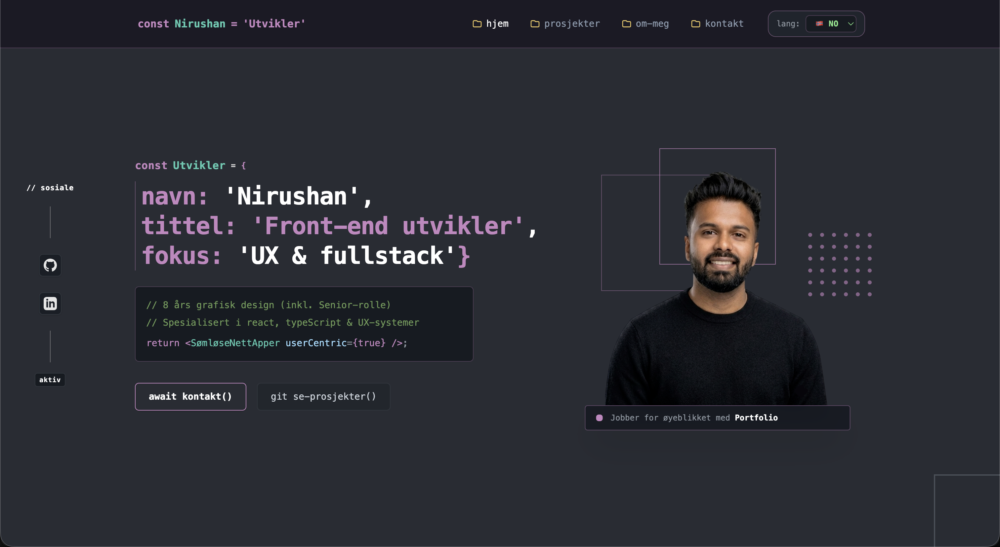
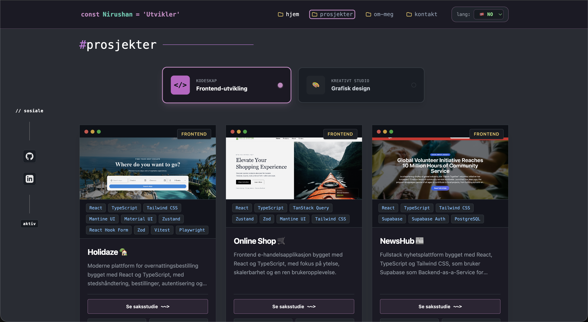
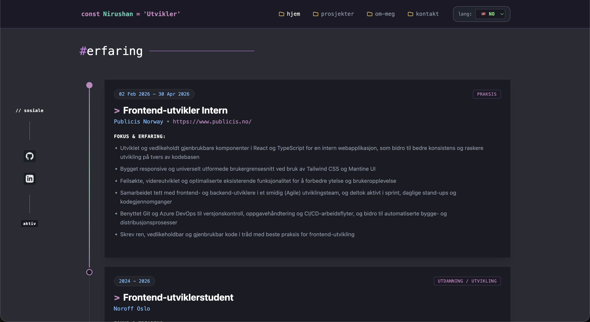
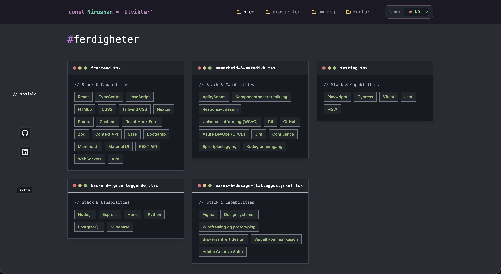
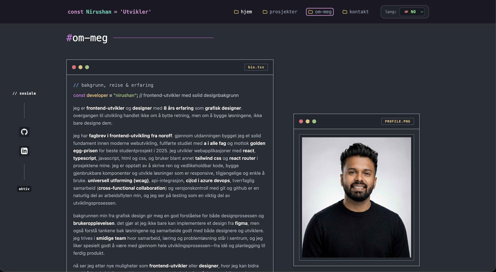
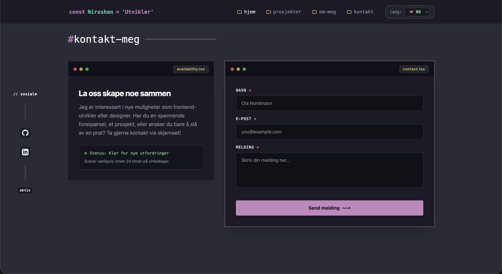

# 🎯 Developer & Designer Portfolio

This repository contains my personal **Developer & Designer Portfolio website**, built to showcase my projects, professional experience, design skills, and technical expertise as a frontend developer and UI/UX designer.

The project features a sleek developer terminal aesthetic, full **bilingual support (Norwegian and English)**, strict **WCAG 2.1 AA accessibility compliance**, and an interactive project case study viewer.

---

## 📸 Preview








---

## 🚀 Live Project

- **Live Demo:** [View Portfolio](https://portfolio-new-2.netlify.app/)

---

## 🧩 Features

- **Bilingual Experience**
  - Instant language switcher supporting English (`EN`) and Norwegian (`NO`) across all sections and components.
- **Dynamic Project Showcase**
  - Filterable frontend web applications and graphic design projects with custom tags, live previews, and color palettes.
  - Dedicated case study detail views with comprehensive breakdowns.
- **Robust Contact System**
  - Integrated secure contact form powered by **Web3Forms**.
  - Advanced form validation using `react-hook-form` and **Zod** with localized error messages.
- **Accessibility & Compliance (WCAG 2.1 AA)**
  - Semantic HTML landmarks (`<footer>`, `<nav>`, `<section>`), keyboard navigation support, visible focus states, and complete `aria-*` attributes.
- **Developer Terminal Aesthetic**
  - Custom dark theme blending modern styling with terminal window header elements, code accents, and status indicators.

---

## 🧠 Tech Stack

| Category               | Technology                   |
| :--------------------- | :--------------------------- |
| **Language**           | **TypeScript (Strict Mode)** |
| **Library**            | **React**                    |
| **Styling**            | **Tailwind CSS**             |
| **Build Tool**         | **Vite**                     |
| **Routing**            | **React Router DOM**         |
| **Forms & Validation** | **React Hook Form / Zod**    |
| **API & Submissions**  | **Web3Forms API**            |
| **Hosting**            | **Netlify / Vercel**         |
| **Design**             | **Figma**                    |

---

## 🗂️ Project Structure

```text
PORTFOLIO-NEW/
├── dist/
├── node_modules/
├── public/
│   ├── awards/
│   ├── graphic-design/
│   └── projects/
├── src/
│   ├── components/
│   │   ├── Experience/
│   │   ├── project-details/
│   │   ├── projects/
│   │   ├── AboutSection.tsx
│   │   ├── BackgroundAccents.tsx
│   │   ├── ContactSection.tsx
│   │   ├── Footer.tsx
│   │   ├── Hero.tsx
│   │   ├── HonorsAwards.tsx
│   │   ├── Navbar.tsx
│   │   ├── QuoteSection.tsx
│   │   └── SkillsSection.tsx
│   ├── constants/
│   │   └── translations.ts
│   ├── data/
│   │   └── projectsData.ts
│   ├── pages/
│   │   ├── HomePage.tsx
│   │   └── ProjectDetailPage.tsx
│   ├── theme/
│   │   └── colors.ts
│   ├── types/
│   │   ├── contactValidation.ts
│   │   └── portfolio.ts
│   ├── utils/
│   ├── App.tsx
│   ├── index.css
│   └── main.tsx
├── .env
├── .gitignore
├── eslint.config.js
└── index.html

```

## ⚙️ Getting Started

### 1. Clone the Repository

```bash
git clone https://github.com/Nirush4/portfolio-new
```

```bash
npm install
```

```bash
npm run dev
```

```bash
npm run build
```

## License

This project is licensed under the MIT License. See [LICENSE](LICENSE) for details.

---

## Author 👨‍💻​

• Nirushan Rajamanoharan (@Nirush4)

**Happy coding!**
